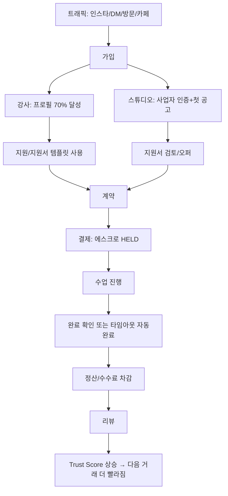
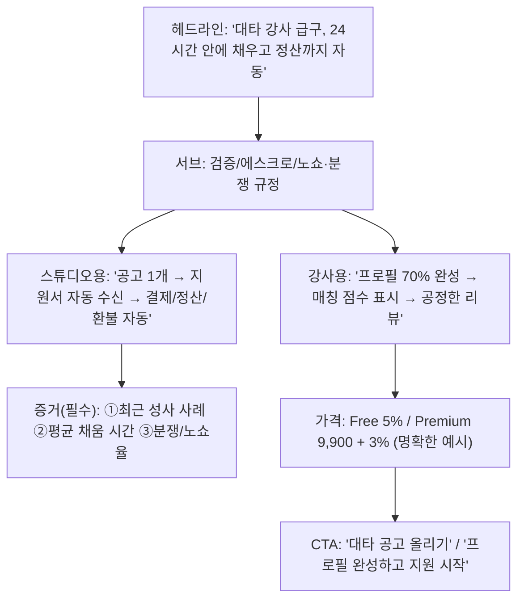
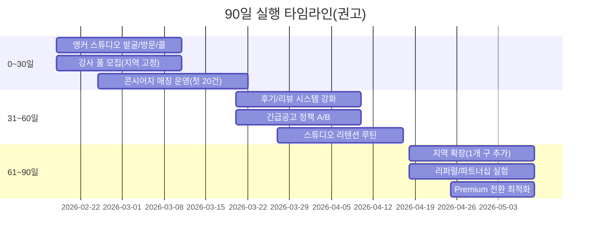

# 필라테스 강사–스튜디오 매칭 플랫폼 PRD·README 기반 판매·GTM·운영·컴플라이언스 분석 보고서

본 보고서는 사용자가 제공한 PRD(v2.2.0, 2026-02-18) 및 README 문서의 요구사항·설계·구현 상태를 기반으로 제품 범위/흐름/데이터·API를 구조화하고, 경쟁·대체수단을 근거 기반으로 비교한 뒤, “실제 판매(유료 전환·거래 발생)”를 만들기 위한 실행 가능한 GTM·영업·운영·보안 체크리스트를 제시한다. fileciteturn0file0 fileciteturn0file1

## Executive summary

이 제품은 전형적인 “양면시장(강사–스튜디오)”이지만, 단순 게시판이 아니라 **신뢰(verification+trust score)+에스크로 결제/정산+분쟁/패널티+양방향 리뷰**까지 포함된 **거래형(트랜잭션) 마켓플레이스**로 정의하는 게 판매에 유리하다. fileciteturn0file0

핵심 인사이트는 세 가지다.

첫째, **판매의 1차 목표는 ‘가입자 수’가 아니라 ‘첫 거래 완료(Completed) 케이스’**다. PRD에도 “신뢰, 정확성(계약/결제 오류 없는 동작), 안정성”이 반복해서 등장하는데, 이 시장은 결국 “거래 성공”이 신뢰를 만든다. fileciteturn0file0

둘째, **경쟁/대체수단의 가장 큰 약점은 ‘신뢰와 안정성’**이다. 예컨대 entity["company","호호요가","korean fitness job app"]는 앱스토어 평점(한국 스토어 기준)과 리뷰에서 “화이트 스크린/접속 불가/UX 불편”류 불만이 다수 확인된다. citeturn13view0 반면 entity["company","바운드","korean instructor job app"]는 “맞춤 구인구직”, “원클릭 지원”, “이력서/동영상” 등 **채용(매칭) 중심** 가치를 전면에 내세운다. citeturn12view0 즉, 당신 제품은 “매칭”만으로는 차별이 약하고, **‘정산/에스크로·규정·분쟁 처리 자동화’가 차별의 중심**이 되어야 한다. fileciteturn0file0

셋째, **문서/브랜딩의 불일치가 즉시 매출을 깎을 리스크**다. PRD는 v2.2에서 “보증금 시스템 완전 제거”를 명시하는데, README엔 “보증금 충전” 흐름과 엔드포인트가 남아 있다. 이는 런칭 직전 영업/마케팅에서 불신을 만든다. (외부로 노출되는 README/랜딩/FAQ는 PRD 정책과 100% 일치해야 함) fileciteturn0file0 fileciteturn0file1

권고 우선순위(요약):

- **Must-do**: (1) “보증금 제거” 메시지/문서 완전 정리, (2) “긴급 대타 + 안전 정산” 한 가지 웨지로 지역 런칭(1~2개 구) 고정, (3) 초기에 **수동 운영(콘시어지)**로 첫 20~50건 거래를 만들어 케이스 스터디 확보, (4) 이탈/노쇼/분쟁 SOP와 고객 응대 채널을 판매 프로세스의 일부로 설계. fileciteturn0file0  
- **Should-do**: “긴급 매칭”을 Premium 완전 가림이 아니라 “프리미엄 선공개/우선 알림” 형태로 바꿔 초기 유동성(특히 급구)을 해치지 않도록 A/B 운영. fileciteturn0file0  
- **Optional**: 스튜디오 구독(또는 공고부스트) 등 수익모델 확장 실험은 30~60일차 이후, ‘거래 성공’이 반복되는 구간에서 시작.

## 제품 범위와 사용자 흐름

### 제품 스코프 요약

PRD v2.2 기준 핵심 컴포넌트는 (사용자 정의 그대로) **구인구직, 정산(에스크로 결제/환불/정산), 리뷰(양방향 리뷰+Trust Score)**이며, 이를 받치는 신뢰 시스템이 “5-Layer Trust System”으로 설계돼 있다. fileciteturn0file0  

- 구인구직: 공고(Job Post)·지원(Application)·오퍼(Offer)·계약(Contract) 상태머신, 매칭 알고리즘(지역/경력/자격증/시급 가중치) 및 Premium 부스트, “긴급 매칭(24h 이내)”과 “지원서 템플릿” 등 Premium 유인 기능 포함. fileciteturn0file0  
- 정산: 스튜디오 결제 → 에스크로 HELD → 수업 완료 상호 확인/타임아웃 자동완료 → RELEASED → 강사 정산(Free 95% / Premium 97%) 구조. 결제는 entity["company","TossPayments","korean payments gateway"] 기반 연동이 전제돼 있으며 결제 승인 시 `paymentKey`, `orderId`, `amount` 저장 및 승인 API 호출 등 일반적인 PG 통합 절차와 맞물린다. fileciteturn0file0 citeturn19search2turn19search4  
- 리뷰: 계약 완료 후 7일 이내, “전문성/시간 준수/커뮤니케이션/종합 만족도” 1~5점, 양측 작성 완료 후 공개(사실상 쌍방 블라인드에 가까운 구조). fileciteturn0file0  

### 현재 자동화된 기능(운영 관점)

PRD는 1인 운영을 전제하면서 “사람은 예외만 다룬다”를 원칙으로 자동화/수동 개입 경계를 명시한다. 자동화로 설계된 대표 항목:

- 이의제기 없는 노쇼 신고 자동 확정 및 계정 정지 누적 처리  
- 정책 기반 취소/환불 자동 처리  
- 수업 완료 확인 타임아웃(24~48h) 자동 완료 처리  
- Free 동시 지원 5개 초과 시 자동 거부 + 업그레이드 유도(에러코드 APPLICATION_LIMIT)  
- Trust Score 이벤트 트리거 기반 자동 재계산  
- 프로필 완성도 70% 미달 시 액션 차단(에러코드 PROFILE_INCOMPLETE) fileciteturn0file0  

반대로 “사람이 개입하는 구간”은 자격증 검증(현재 수동), 분쟁 이의제기 시 최종 판정 등으로 축소되어 있다. fileciteturn0file0

### 사용자 흐름 요약

#### 스튜디오 운영자 흐름(거래 발생까지)

1) 가입(스튜디오 역할) → 2) 본인 인증 + 사업자 검증(국세청 API를 통한 검증 흐름이 PRD에 명시) → 3) 프로필 완성도 게이트 통과(70%) → 4) 공고 등록(또는 강사 탐색) → 5) 지원서 수신/오퍼 발송 → 6) 계약 확정 → 7) 결제(에스크로 HELD) → 8) 수업 완료 확인(원탭) → 9) 리뷰 작성 fileciteturn0file0  

#### 강사 흐름(매출/정산까지)

1) 가입(강사) → 2) SMS OTP 본인 인증 → 3) 프로필/지역/경력 입력(온보딩 3화면) → 4) 프로필 완성도 70% 달성 시 지원 가능 → 5) 지원(Free: 동시 5개 제한, Premium: 무제한) → 6) 오퍼 수락 → 7) 계약 → 8) 수업 진행 → 9) 양측 완료 확인 or 타임아웃 자동완료 → 10) 정산(수수료 차감) → 11) 리뷰 → 12) Trust Score 업데이트 fileciteturn0file0  

### 데이터 모델·핵심 엔티티·API 개요

PRD/README 공통적으로 `users`, 강사/스튜디오 프로필, `job_posts`, `applications`, `offers`, `contracts`, `payments`(에스크로 상태 포함), `payouts`, `reviews`, `disputes`, 구독/히스토리 테이블이 핵심이며, v2.2에서 `application_templates`가 추가된다. fileciteturn0file0 fileciteturn0file1

API는 `/api/v1` 하위로 인증, 공고/지원, 계약, 정산/결제, 분쟁, Premium 구독, Admin 영역이 구성돼 있고, v2.2에서 “Free 동시 지원 제한”, “프로필 완성도 게이트”, “긴급 매칭 Premium 전용”을 서버 에러코드로 명시해 UX/세일즈 트리거로 활용하도록 설계돼 있다. fileciteturn0file0  

## 타깃 세그먼트와 페인포인트 우선순위

### 세그먼트 정의

문서 기반 3개 역할은 다음과 같다: 스튜디오(수요), 강사(공급), 관리자(운영/분쟁/검증). fileciteturn0file0

다만 “누가 돈을 내는가” 기준으로는 조금 더 날카롭게 나눠야 한다.

- **결제자(거래금액 지불)**: 스튜디오(수업 대가를 결제) fileciteturn0file0  
- **플랫폼 과금 실질 부담 주체(수수료 차감)**: 강사(정산 시 수수료 차감) fileciteturn0file0  
- **구독(Premium) 타깃**: 현재 설계상 강사 중심(“월 9,900원, 수수료 3%, 무제한 지원, 부스트, 긴급 매칭” 등) fileciteturn0file0  

이 구조는 “스튜디오 도입 장벽이 낮은 대신(무료처럼 느낌)”, “강사 측에서 이탈/우회(직거래) 유인이 생길 수 있다”는 트레이드오프가 있다. 따라서 판매 전략은 **스튜디오 ‘결제 전환’이 아니라 ‘공고 등록→계약 체결’ 전환을 먼저 만들고**, 그다음 “강사 측 Premium 전환”을 붙이는 순서가 안전하다.

### 페인포인트 우선순위(증거 기반)

우선순위는 “자주 발생 + 금전 손실/운영 리스크 + 기존 대체수단이 해결 못함” 기준으로 잡는 게 맞다.

- 1순위: **급구(대타) 공백**  
  “오늘/내일 수업 펑크”는 스튜디오 손실이 즉각적이고(환불/회원 불만/리텐션 하락), 기존 채널이 분산(단톡/오픈채팅/인맥)돼 있어 탐색 비용이 크다. 실제로 업계에서 구인/구직이 entity["company","카카오톡","korean messaging app"] 오픈채팅을 통해 비효율적으로 이뤄졌다는 프로젝트 사례 서술이 있다. citeturn1search6  
- 2순위: **정산 불신(미지급/계산 오류/환불 분쟁)**  
  “송금 기반 직거래”는 빠르지만 분쟁/사기/증빙 문제를 남긴다. 당신 제품은 에스크로와 정책 기반 자동 환불/정산을 핵심 가치로 내장하고 있으므로, 판매 메시지에서 “구인구직”보다 “정산 안정성”을 앞세우는 편이 전환에 유리하다. fileciteturn0file0  
- 3순위: **검증/평판 부재(가짜 프로필/무자격/노쇼)**  
  PRD는 신뢰 문제를 기존 서비스의 핵심 결함으로 분류하고(가짜 프로필/노쇼/분쟁 미해결), 이를 Trust Score/본인·사업자 인증/패널티/리뷰로 해결한다고 설계한다. fileciteturn0file0  
  경쟁 서비스인 호호요가는 앱스토어 리뷰에서 “실행 안 됨/하얀 화면” 등 안정성 불만이 확인돼, “안정적이고 간결한 UX”라는 PRD 가치 제안이 설득력을 가진다. citeturn13view0  

정리하면, **초기 판매(거래 발생)**는 아래 한 문장으로 정렬하는 게 강하다.

> “대타가 급할 때, 검증된 강사를 빠르게 구하고, 돈 문제(정산/환불/분쟁)를 자동으로 끝내는 플랫폼”

이 문장을 중심으로 영업 스크립트/랜딩/온보딩을 재작성해야 한다.

## 경쟁·대체수단 분석

### 경쟁 구도 요약

이 시장의 경쟁자는 “같은 기능”이 아니라 “같은 문제를 푸는 다른 방식”이다. 즉 **직접 경쟁(강사-스튜디오 구인구직 앱)** + **부분 대체(운영/정산 툴)** + **비공식 채널(오픈채팅/인스타/카페)**가 동시에 경쟁한다.

- 직접 경쟁: entity["company","쌤구해요","wellness instructor platform"](구인구직·커뮤니티), 호호요가(각종 스포츠 강사 구인구직) citeturn18view0turn13view0  
- 인접 경쟁: entity["company","바운드","korean instructor job app"](맞춤 구인구직 + 이력서/기업강의/워크샵), entity["company","베리에이션","pilates sequence app"](시퀀스 생성 중심이지만 “채용 앱” 포지셔닝 포함) citeturn12view0turn10search3  
- 부분 대체(운영툴): entity["company","바디코디","korean fitness management software"](스케줄/회원관리/자동정산 등 센터 운영툴) citeturn14view0  
- 비공식 대체: 카카오톡 오픈채팅·인스타 DM·지인 추천·엑셀/계좌이체 등(“빠르지만 위험하고 비효율적”) citeturn1search6  

### 비교표: 기능·가격·GTM·공백

| 구분 | 핵심 포지션 | 구인구직 | 정산/에스크로 | 리뷰/평판 | 검증(본인/사업자/자격) | GTM 관찰 | 공백(당신이 파고들 틈) |
|---|---|---:|---:|---:|---:|---|---|
| **당신 제품(PilaMatch)** | 신뢰 기반 거래형 매칭 | O | O | O | O | “안전 거래·정확성·간결 UX” 지향(문서) fileciteturn0file0 | “첫 거래”를 빠르게 만들 콘시어지/영업 체계가 성패 |
| 호호요가 | 다양한 스포츠 강사 구인구직 앱 | O | ? | ? | ? | 앱스토어 리뷰에서 UX/접속 문제 불만 확인 citeturn13view0 | 안정성/신뢰/분쟁·정산 구조가 약점일 가능성 |
| 바운드 | 맞춤 구인구직+강사 커리어툴 | O | ? | ? | ? | “5초 맞춤 구인구직”, “원클릭 지원”, “이력서/동영상” citeturn12view0 | 결제·정산·분쟁 해결을 ‘거래’로 닫는 구조는 불명확 |
| 쌤구해요 | 웰니스 강사 구인구직+커뮤니티 | O | ? | ? | ? | “구인구직 및 커뮤니티 플랫폼” 표방 citeturn18view0 | 에스크로/정책 기반 정산·분쟁 처리 공백 가능 |
| 베리에이션 | 시퀀스/콘텐츠+채용 요소 | (△) | ? | ? | ? | 앱 소개에서 “필라테스… 채용 앱” 강조 citeturn10search3 | 채용이 코어라기보다 부가 기능일 가능성 |
| 바디코디 | 센터 운영(스케줄/회원/정산) | X | (내부정산 O) | ? | ? | “스케줄/출결/회원관리/자동정산” 등 운영툴 citeturn14view0 | “센터 간/시장 전체” 매칭 문제는 해결하지 않음 |

표에서 물음표(?)는 공개 정보만으로 확인 불가한 영역이며(추정 배제), 실제 영업에서는 “상대가 쓰는 방식”을 인터뷰로 확인해 문장으로 바꿔야 한다.

### 경쟁 전략적 시사점

- entity["company","Apple","consumer electronics company"] 앱스토어 리뷰는 “업계 현장 문제”를 간접적으로 드러낸다. 호호요가 리뷰에서 “앱이 안 열림/하얀 화면”, “동선 고려 안 된 UX” 등의 불만은, 당신이 내세우는 “안정성/간결함” 메시지의 근거가 된다. citeturn13view0  
- 반대로 바운드는 “구직 탐색 비용”을 줄이는 메시지가 강하다(맞춤/원클릭/이력서). 당신은 “탐색 비용”뿐 아니라 “거래 리스크(정산/환불/노쇼/분쟁)”까지 해결하는 쪽으로 메시지를 차별화해야 한다. citeturn12view0  

## Go-to-market 및 세일즈 플레이북

### 웨지(초기 판매를 여는 1개 문제) 정의

PRD가 이미 “긴급 매칭(24h 이내 공고)”을 Premium 가치로 설계했는데, 시장적으로도 **긴급 대타**가 거래를 일으키는 최단 경로다. fileciteturn0file0  

따라서 런칭 초기는 이렇게 고정하는 게 좋다.

- **카테고리 웨지**: “대타/단기(주말·휴일·당일)” 중심  
- **지역 웨지(미지정 시 옵션)**: PRD는 서울/경기 확장을 목표로 하지만, 초기 런칭 구/동은 명시돼 있지 않다. 따라서 “강남/서초/송파”처럼 스튜디오 밀집 지역 1~2개 구로 고정하거나, 반대로 “한강 이남 1개 구”처럼 운영 가능 범위로 고정해야 한다(선택 옵션). fileciteturn0file0  

초기 판매는 SaaS처럼 “가입→셀프서브→결제”가 아니라, **“거래 성사” 자체를 파는 콘시어지 영업**이 더 빠르다.

### 가격 모델 옵션과 권고 실험

PRD의 기본 과금은 “강사 정산에서 수수료 차감(Free 5% / Premium 3%) + 강사 구독(월 9,900)”이다. fileciteturn0file0  

초기(첫 90일)에는 아래 3가지 모델을 “한 번에 정답 찾기”가 아니라 “실험”으로 운용하는 것을 권한다.

| 옵션 | 과금 구조 | 장점 | 리스크 | 추천 사용 시점 |
|---|---|---|---|---|
| A(현 PRD) | 강사 수수료 차감 + 강사 구독 | 스튜디오 도입 장벽 낮음 | 강사 이탈/우회(직거래) 유인 | 거래 성사가 반복되는 구간(리뷰/Trust가 쌓일 때) |
| B | 스튜디오 구독(공고/채용) + 강사 무료 | 수요 측(돈/권한 있는 쪽)에서 매출 | 소규모 스튜디오가 “또 구독?” 거부 | 앵커 스튜디오(체인/다점포) 확보 후 |
| C(하이브리드) | 기본 수수료는 낮게 + “긴급공고/부스트/정산옵션” 유료 | 급한 순간에 과금(지불 의사↑) | 설계 복잡도↑ | 30~60일차부터 점진 적용 |

**특히 긴급 매칭의 Premium 완전 비표시 정책은**, 초기에는 “급구인데 강사 풀이 줄어드는” 역효과를 낼 수 있다. 그래서 초반에는 “Premium 30분 선공개 + 이후 전체 공개” 같이 유동성을 해치지 않으면서 프리미엄을 유도하는 형태가 실험 가치가 크다(정책은 서버 플래그로 A/B). fileciteturn0file0

### 전환 퍼널 설계와 운영 지표

아래 퍼널은 “거래 성사”를 최종 목표로 설계되어야 하며, 중간 목표는 양측이 다르다(스튜디오=공고 등록, 강사=프로필 70% 완성). fileciteturn0file0  

퍼널 KPI는 PRD의 성공지표(예: 거래 전환율 30%, 프로필 70% 달성률 >80%, Premium 전환율 15~20%)와 연결해 “주간”으로 보게 해야 한다. fileciteturn0file0

### 영업 플레이북

#### 스튜디오 대상(콜드콜/방문) 핵심 스크립트

- 오프닝(10초):  
  “원장님, **대타 강사 급하게 구할 때** 보통 어디서 구하세요? 오늘/내일 펑크났을 때요.”
- 문제 고정(20초):  
  “그때 보통 **단톡/오픈채팅**으로 올리시죠. 근데 ‘누군지/자격/노쇼’가 불안하고, 정산도 결국 송금이라 분쟁 나면 골치 아프잖아요.” citeturn1search6  
- 제안(20초):  
  “저희는 **‘긴급 대타’만 먼저** 해결합니다. 공고 올리면 강사 풀에 알림하고, **결제는 에스크로로 잡아두고** 수업 끝나면 자동 정산돼요. 환불/노쇼 규정도 미리 고지돼서 분쟁이 줄어듭니다.” fileciteturn0file0  
- CTA(10초):  
  “이번 주 안에 대타 예정 있으세요? 있으면 **첫 건은 제가 공고 등록까지 같이 도와드리고**, 성공하면 계속 쓰는 방식으로 가보시죠.”

초기에는 “가입하세요”가 아니라 **‘당장 필요한 1건을 해결해드릴게요’**가 전환을 만든다(콘시어지).

#### 강사 대상(인스타 DM/커뮤니티) 핵심 문구

- “송금/미지급 걱정 없는 **에스크로 정산**”
- “프로필 완성도/자격증 검증 → **Trust Score로 검증된 강사**가 되는 구조”
- “Premium은 ‘더 비싼 멤버십’이 아니라 **더 빨리 계약되게 만드는 도구**(수수료 할인+우선 노출+긴급 공고)” fileciteturn0file0  

### 랜딩페이지 카피와 와이어(다이어그램)

랜딩은 “기능 나열”이 아니라 “상황(급구)→결과(채움)→리스크 제거(정산/환불/노쇼)”로 써야 전환된다.

증거(Proof)는 런칭 초기에 수동 운영으로 만들어야 한다(다음 섹션 참조).

## 운영 프로세스와 자동화 로드맵

### 초기 운영 원칙: “플랫폼”이 아니라 “거래 운영팀”처럼 움직이기

PRD는 1인 운영을 전제로 자동화를 극대화하지만, **판매를 일으키는 0→1 구간에서는 수동 운영이 ‘기술 부채’가 아니라 ‘매출 장치’**다. fileciteturn0file0  

초기 30~60일 추천 운영 패턴:

- 스튜디오 20곳을 “앵커”로 확보(월 2회 이상 공고를 올릴 가능성이 있는 곳)
- 강사 200명 확보(지역/경력/자격 최소 요건으로 큐레이션)
- “긴급 대타” 공고는 **운영자가 직접 매칭/리마인드**(푸시/문자)해서 첫 성공률을 올림
- 성공 케이스를 “리뷰/Trust Score”로 고정하여 다음 거래를 더 쉽도록 만듦 fileciteturn0file0  

### 수동 SOP(필수)와 자동화 핸드오프

#### 자격증 검증 SOP(수동→반자동)

PRD 상 v2.2는 자격증 업로드 후 운영자 수동 확인을 기본으로 하고, 추후 발급기관 API 연동을 계획한다. fileciteturn0file0  

- 수동 체크리스트(초기): 발급기관/이름/유효기간/사진 위변조 흔적  
- 자동화 우선순위: “리마인더(만료 30일 전), 재인증 요청, 검증 대기 상태 배지”는 먼저 자동화(판정 자체는 나중)

#### 분쟁 처리 SOP(증거 리포트 자동 생성 + 판정만 수동)

PRD는 “이의제기 없으면 자동 확정”, “이의제기 있으면 48시간 내 증거 심사”로 운영 부하를 줄이도록 설계되어 있다. fileciteturn0file0  

초기엔 판정 일관성이 중요하므로, 판정 룰을 1페이지로 문서화해야 한다(영업에서도 신뢰가 됨).

### 정산/세무 리스크(초기부터 반드시 고려)

플랫폼이 “정산”을 제공하는 순간, 사용자들이 묻는 질문이 확 바뀐다: “세금은요? 3.3 떼나요? 계산서 발행되나요?”

- entity["organization","국세청","national tax service korea"]은 원천징수 안내에서 “원천징수 대상 사업소득 3%” 항목을 명시한다. citeturn16search1  
- 실무적으로는 “사업소득 3% + 지방소득세 0.3%”로 3.3%가 널리 쓰이지만, **강사/스튜디오 관계가 근로인지 사업인지**, 강사가 사업자등록을 했는지, 인적용역 분류가 무엇인지에 따라 처리가 달라질 수 있다(세무/노무 자문 권장). citeturn16search1turn17search3  

따라서 제품/정책 차원에서 최소한 다음을 준비해야 판매가 막히지 않는다.

- “정산 방식 FAQ”: (1) 원천징수 여부(옵션), (2) 세금계산서/현금영수증/증빙, (3) 거래내역 다운로드
- “플랫폼 역할” 명확화: 플랫폼이 고용주가 아니라 중개/결제·정산 대행인지(약관에 명시)

## KPI 및 30/60/90 실행 계획

### KPI 프레임

PRD의 성공지표는 6개월 목표로 MAU 5,000, 거래 전환율 30%, 월 거래액 1억원, 재사용률 60%, NPS 50+ 등을 제시한다. 또한 신뢰 지표(분쟁 발생률 <5%, 자동 해결률 >70%, 프로필 70% 달성률 >80%)와 Premium 지표(전환 15~20%, churn <10%/월)를 별도로 둔다. fileciteturn0file0  

초기(90일) KPI는 “매출”보다 “유동성/거래성공”에 더 높은 가중치를 둬야 한다.

- **Liquidity KPI (가장 중요)**  
  - Time-to-first-applicant(공고 등록 후 첫 지원까지 시간)  
  - Fill rate(공고 대비 계약 성사율)  
  - Time-to-fill(공고→계약까지 시간)  
- **Trust KPI**  
  - No-show rate, Dispute rate, 리뷰 작성률(쌍방 완료율)  
- **Monetization KPI**  
  - GMV(거래액), Take rate, Premium 전환율, 구독 유지  
- **Funnel KPI**  
  - 강사: 가입→프로필 70% 달성(7일 이내)→첫 지원→첫 계약  
  - 스튜디오: 가입→사업자 인증→첫 공고→첫 계약  

### 30/60/90 플랜(실행 단위: 주)

아래 숫자는 “구/동 1~2개 지역 런칭”을 가정한 권고치이며, 초기 지역/예산/가격 민감도가 문서에 명시되지 않았으므로(미지정), 보수적으로 설정했다(옵션으로 상향/하향 가능). fileciteturn0file0  

| 기간 | 최우선 목표 | 주간 마일스톤(핵심만) | 필요 자산/역할 | KPI 목표(권고) |
|---|---|---|---|---|
| 0~30일 | “첫 거래 20건” 만들기 | W1: 스튜디오 30곳 리스트업+접촉 50회 / W2: 앵커 스튜디오 10곳 확보 / W3: 강사 150명 온보딩+검증 / W4: 긴급공고 30개 처리 | 대표(영업+운영) + 파트타임 CS/검증(가능하면) | 완료 거래 20, Fill rate 30%+, 프로필 70% 달성률 60%+ |
| 31~60일 | “반복 거래” 만들기 | 앵커 스튜디오 30곳으로 확대, 후기/리뷰 50건 확보, 분쟁/환불 SOP 고도화, 긴급공고 실험(A/B) | 랜딩/세일즈 덱, 가격 실험안, 온보딩 자동화 | 월 완료 거래 60, 재사용률(30일) 30%+ |
| 61~90일 | “확장 가능한 영업 루틴” 고정 | 지역 1개 구 추가, 추천 프로그램(스튜디오→스튜디오, 강사→강사), Premium 전환 퍼널 최적화 | 리퍼럴 코드/정산 리포트/대시보드 | 월 완료 거래 120, Premium 전환 8~12%(초기), 분쟁 <5% |

### 타임라인(가시화)

### KPI 대시보드 목업(운영/영업 공용)

- 주간 보드(필수 10개):
  - 신규 스튜디오(인증 완료), 신규 강사(프로필 70%+), 공고 수, 긴급 공고 수  
  - 평균 Time-to-first-applicant, 평균 Time-to-fill, 완료 거래 수(Completed)  
  - 환불률, 분쟁률, 노쇼율  
  - Premium 전환(가입/유지/이탈), APPLICATION_LIMIT→업그레이드 전환율 fileciteturn0file0  

## 보안·개인정보·결제 컴플라이언스와 리스크 관리

### 결제·정산 보안 체크리스트

- **PG 시크릿 키 관리**: entity["company","TossPayments","korean payments gateway"] 결제 통합 가이드에서 시크릿 키 외부 노출 금지를 명시하고, 승인 API 호출을 위한 인증 헤더 생성 방식까지 안내한다. 운영상 “키 노출=즉시 사고”로 봐야 한다. citeturn19search0turn19search4  
- **카드정보 비저장 원칙**: 카드번호 등 민감정보는 직접 저장하지 않고 PG 토큰/키로 처리(PCI 범위 축소). PCI 보안 표준은 entity["organization","PCI Security Standards Council","payment security body"]이 발행한다. citeturn3search2  
- **결제/취소 멱등성**: 취소 API는 멱등키 사용을 권장하는 문서가 존재하므로, “중복 취소/정산 오류” 방지에 적용해야 한다. citeturn19search2  

### 개인정보·약관(한국 규제) 체크리스트

- entity["organization","개인정보보호위원회","korea data protection authority"]는 개인정보 처리방침 작성지침을 통해 처리방침의 목적(절차/기준 안내, 투명성 확보)과 자료를 제공한다. 최소한 방침·수집항목·보유기간·위탁/제3자 제공·파기·권리행사·안전조치가 정리돼 있어야 “정산/인증” 기능을 판매할 수 있다. citeturn9view0  
- 거래형 서비스는 “거래기록/분쟁기록 보존”이 불가피하다. 전자상거래 관련 법령에 따라 결제/공급 및 분쟁 기록을 일정 기간 보존한다는 고지 예시는 다수 사이트의 개인정보처리방침에서 확인된다(예: 결제·공급 기록 5년, 분쟁 3년 등). citeturn6search1turn6search8  
- PRD의 데이터 보관 정책(완료 계약 5년, 분쟁 3년, 로그 3개월 등)은 “정산/분쟁”을 다루는 서비스에 필요한 운영 현실을 반영한다. 다만 실제 법적 요구사항과 정확히 맞추는 검증이 필요하다. fileciteturn0file0  

### 리스크와 대응(시장·유동성·사기·이탈)

- **유동성(가장 큰 리스크)**: 초기엔 공고가 떠도 지원이 없으면 스튜디오가 떠난다. 대응은 “지역 고정 + 콘시어지 + 앵커 스튜디오”다.  
- **긴급공고 Premium 독점의 역효과**: 급구일수록 풀을 넓혀야 채워지는데, Premium 완전 비표시가 채움률을 떨어뜨릴 수 있다. 대응은 “선공개/우선알림”형으로 조정하며 A/B로 채움률을 비교한다. fileciteturn0file0  
- **직거래(수수료 회피)**: 채팅 후 외부 송금으로 빠질 수 있다. 대응은 “에스크로+정산 리포트+분쟁/노쇼 보호”를 거래 편익으로 만들고, 반복 거래는 플랫폼 안이 더 편하다는 경험을 제공한다. fileciteturn0file0  
- **사기/허위자격**: 자격증 검증을 수동으로라도 강하게 운영해야 ‘초기 평판’이 산다. 이후 API 자동화는 Phase 3로 합리적이다. fileciteturn0file0  
- **노무/세무 분쟁**: 필라테스 강사처럼 프리랜서/근로자성 판단이 케이스마다 다르고, 기관 판정에서도 근로자성 부정 사례가 공개된 바 있다. 플랫폼은 고용주가 아니라는 점, 정산과 증빙 제공 범위를 약관·UX에 명확히 해야 한다. citeturn17search3turn16search1  

### 실행 우선순위(노력/임팩트)

| 우선 | 항목 | 이유 | 노력 | 임팩트 |
|---|---|---|---|---|
| Must-do | PRD v2.2(보증금 제거)와 README/랜딩/FAQ 완전 정합 | 불신·이탈 방지(영업 직결) fileciteturn0file0 | S | H |
| Must-do | “긴급 대타 + 안전 정산” 웨지로 지역 런칭 고정 | 유동성/성공 케이스 최단 경로 | M | H |
| Must-do | 앵커 스튜디오 10~20곳 콘시어지 운영 | 첫 거래 20건이 이후 모든 전환을 당김 | M | H |
| Should-do | 긴급공고 노출 정책 A/B(독점→우선권) | 채움률 vs 프리미엄 전환 최적점 탐색 | M | H |
| Should-do | 정산/세금/증빙 FAQ + 거래내역 다운로드 | 정산 기능 판매의 필수 신뢰 요소 | M | M~H |
| Optional | 스튜디오 구독/부스트 상품 실험 | 수익 다각화(반복 거래 후) | M | M |
| Optional | 자격증 자동 검증(기관 API) | 운영 비용 절감, 장기적 신뢰 강화 | L | M |

본 보고서에서 “초기 판매를 일으키는 핵심”은 기능 추가가 아니라, **거래 성공을 만들어내는 영업·운영 루틴을 제품(정책/자동화)과 결합하는 것**이다. PRD가 이미 자동화 가능한 구조(완성도 게이트, 에러코드 기반 업그레이드, 자동 환불/완료, 분쟁 자동 리포트)를 갖추고 있으므로, 남은 과제는 그 구조를 “세일즈 플레이”로 번역하는 일이다. fileciteturn0file0