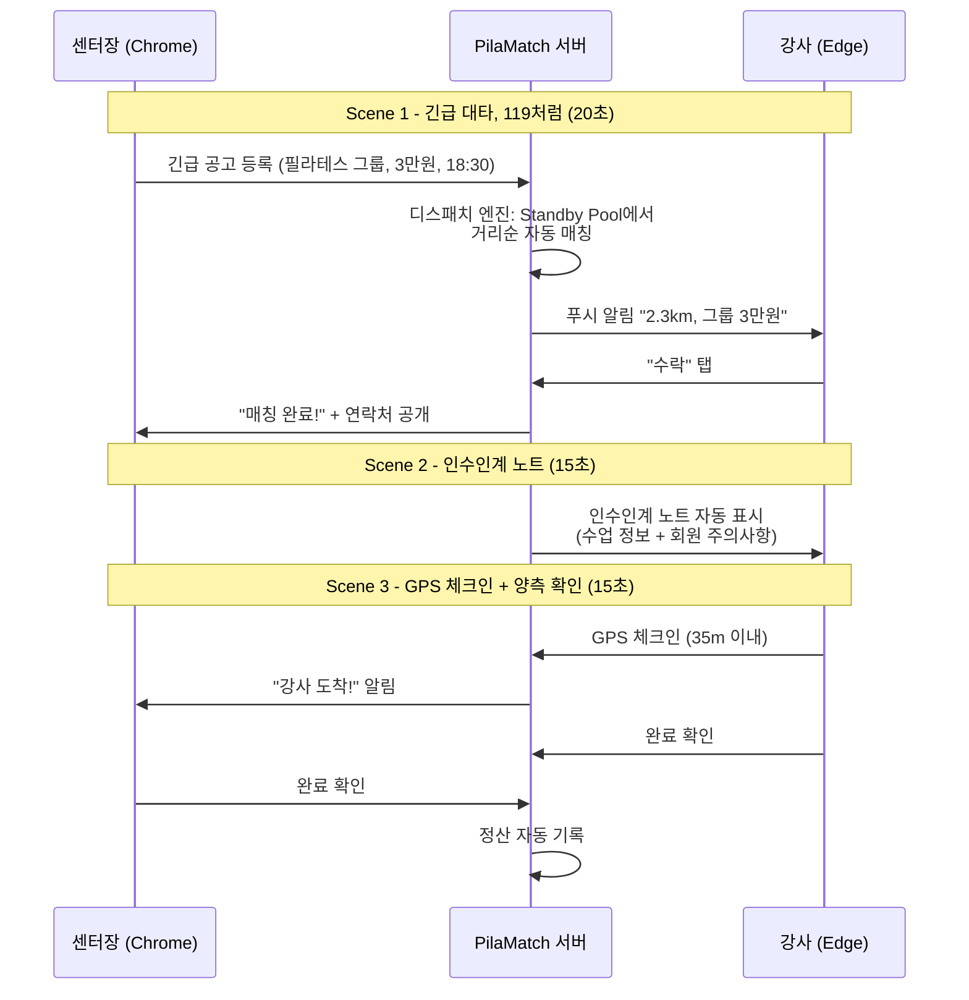

# PilaMatch Demo 영상 시나리오 (1분)

> 작성일: 2026-03-29 | 브랜치: `pivot/emergency-119`

---

## 목적

호호요가 커뮤니티 센터장/강사에게 콜드메일로 보낼 1분 데모 영상 시나리오.

**핵심 메시지**: "호호요가 게시판보다 10배 빠르고 안전한 긴급 대타 매칭"

---

## 타겟 오디언스

| 대상 | 핵심 관심사 |
|------|------------|
| 서울 필라테스 센터장 (구인 담당) | 수업 펑크 방지, 노쇼 리스크 제거 |
| 프리랜서 필라테스 강사 (대타/정규 구직) | 가까운 곳 빠른 매칭, 정산 투명성 |

---

## 3 Scenes (총 50초) + 마무리 (10초)

### Scene 1: 긴급 대타, 119처럼 (20초)

**페인포인트**: 호호요가에 급한 대타 글 올리고 댓글/문자 기다리며 1시간+ 허비

**데모 화면**:

```
[센터 화면 - Chrome]
1. 대시보드 → "긴급 공고 등록" 버튼 클릭
2. job-creation-form: 시간/급여/카테고리 입력 → 등록

[강사 화면 - Edge]
3. 2초 후 push-provider 알림: "2.3km, 그룹 3만원"
4. dispatch-accept-dialog → "수락" 탭

[센터 화면 - Chrome]
5. dispatch-status-widget: "강사 매칭 완료!" + 연락처 자동 공개
```

**자막**: "게시글 올리고 기다릴 필요 없이, 119처럼 자동으로 가장 가까운 강사에게 연결"

---

### Scene 2: 인수인계 노트 (15초)

**페인포인트**: 대타 와도 수업 내용 모르고 어색하게 시작

**데모 화면**:

```
[강사 화면 - Edge]
1. 매칭 수락 직후 → dispatch-accept-dialog 내 인수인계 노트 자동 표시
2. handoff-note-form 데이터:
   - 공개 정보: "타워리포머 5:1 그룹 / 중급 / 60분"
   - 수락 후 공개: "3번 자리 회원 허리디스크 주의, 기구 스프링 세팅 3-2-1"
```

**자막**: "대타 강사도 단골처럼. 수업 내용/회원 특이사항 자동 전달"

---

### Scene 3: GPS 체크인 + 양측 확인 (15초)

**페인포인트**: 노쇼 걱정, 정산 분쟁

**데모 화면**:

```
[강사 화면 - Edge]
1. job-progress-tracker: 센터 도착 → "체크인" 버튼
2. use-geolocation hook → "35m 거리, 도착 확인" 체크 표시

[센터 화면 - Chrome]
3. dispatch-status-widget: "강사 도착!" 실시간 업데이트

[양측 화면 - 좌우 분할]
4. 수업 후 "완료 확인" 버튼 → 정산 자동 기록
```

**자막**: "노쇼 걱정 끝. GPS 도착 인증 + 양측 완료 확인으로 신뢰 보장"

---

### 마무리: 얼굴 노출 + 설문 유도 (10초)

**멘트** (직접 카메라 보며):

> "제가 직접 만들고 있는 앱입니다. 실제로 사용하시겠다면 설문 한 번만 부탁드려요.
> 20분 이상 OK 해주시면 완성해서 출시합니다!
> 설문 응답해주시면 맛있는 커피 들고 찾아가겠습니다 ㅎㅎ"

---

## 전체 플로우 다이어그램



---

## 촬영 가이드

| 항목 | 설정 |
|------|------|
| 센터 화면 | Chrome 브라우저, 모바일 뷰 375x812 (iPhone SE) |
| 강사 화면 | Edge 브라우저, 모바일 뷰 375x812 (iPhone SE) |
| 화면 전환 | 좌우 분할 또는 PIP (Picture-in-Picture) |
| 마무리 | 웹캠 정면 촬영, 자연광 |
| 편집 도구 | OBS Studio (화면 녹화) + CapCut (자막/편집) |
| 해상도 | 1920x1080 (YouTube/메일 공유 대응) |
| 자막 | 하단 중앙, 흰색 텍스트 + 반투명 검정 배경 |

---

## 필요한 데모 데이터

### 계정

| 역할 | 이름 | 위치 | GPS |
|------|------|------|-----|
| 센터 | 트루바디필라테스 | 서울 양천구 | 37.5170, 126.8560 |
| 강사 A (매칭 대상) | 김민지 | 2.3km 거리 | 37.5200, 126.8750 |
| 강사 B (백업) | 이서연 | 5.1km 거리 | 37.5100, 126.9050 |
| 강사 C (원거리) | 박하율 | 12km 거리 | 37.5650, 126.9770 |

### 공고

| 항목 | 값 |
|------|-----|
| 카테고리 | 필라테스 |
| 수업 형태 | 그룹 (5:1 타워리포머) |
| 급여 | 30,000원/타임 |
| 시간 | 오후 6:30 (당일) |
| 긴급 모드 | ON (`is_urgent: true`, `dispatch_mode: auto`) |

### 인수인계 노트

| 구분 | 내용 |
|------|------|
| 수업 주제 (공개) | 타워리포머 5:1 그룹 / 중급 / 60분 |
| 진도 (공개) | 사이드 레그 시리즈 + 숄더 브릿지 |
| 분위기 (공개) | 밝고 에너지 넘치는 분위기 선호 |
| 회원 주의사항 (수락 후 공개) | 3번 자리 회원 허리디스크 - 풀 플렉션 금지 |
| 기구 세팅 (수락 후 공개) | 스프링 세팅: 풀(3R-2Y-1B), 하프(2R-1Y) |

---

## Playwright 자동 캡처 계획

데모 영상에 사용할 스크린샷을 Playwright E2E 테스트로 자동 캡처한다.

| Step | 화면 | 동작 | 캡처 파일명 |
|------|------|------|------------|
| 1 | 센터 (Chrome) | 로그인 → 대시보드 진입 | `demo-01-center-dashboard.png` |
| 2 | 센터 (Chrome) | 긴급 공고 등록 폼 입력 → 등록 완료 | `demo-02-job-creation.png` |
| 3 | 강사 (Edge) | 로그인 → 디스패치 알림 수신 화면 | `demo-03-dispatch-notification.png` |
| 4 | 강사 (Edge) | dispatch-accept-dialog에서 "수락" 클릭 | `demo-04-dispatch-accept.png` |
| 5 | 센터 (Chrome) | dispatch-status-widget "매칭 완료" 상태 | `demo-05-match-complete.png` |
| 6 | 강사 (Edge) | 인수인계 노트 전체 표시 화면 | `demo-06-handoff-note.png` |
| 7 | 강사 (Edge) | GPS 체크인 버튼 클릭 → 도착 확인 | `demo-07-gps-checkin.png` |
| 8 | 센터 (Chrome) | "강사 도착!" 알림 수신 | `demo-08-arrival-confirmed.png` |
| 9 | 양측 | "완료 확인" 버튼 클릭 후 상태 | `demo-09-completion.png` |

### 캡처 실행 환경

```bash
# Geolocation 모킹 필요 (Playwright context options)
# 센터: { latitude: 37.5170, longitude: 126.8560 }
# 강사: { latitude: 37.5200, longitude: 126.8750 }

# 캡처 결과 저장 경로
# test-results/demo-screenshots/
```

### 관련 프론트엔드 컴포넌트 매핑

| Scene | 핵심 컴포넌트 |
|-------|-------------|
| Scene 1 | `job-creation-form.tsx`, `push-provider.tsx`, `dispatch-accept-dialog.tsx`, `dispatch-status-widget.tsx` |
| Scene 2 | `dispatch-accept-dialog.tsx` (내장 노트), `handoff-note-form.tsx` |
| Scene 3 | `job-progress-tracker.tsx`, `use-geolocation.ts`, `dispatch-status-widget.tsx` |

---

## 콜드메일 템플릿 (참고)

```
제목: [1분 영상] 호호요가보다 10배 빠른 긴급 대타 매칭 - PilaMatch

안녕하세요, {센터명} 원장님.

아침에 강사 결근 연락 받으시면 어떻게 하시나요?
카톡 단톡방? 호호요가 게시글?

저희가 만들고 있는 앱은 119처럼 작동합니다.
긴급 버튼 한 번 → 2km 이내 검증된 강사가 자동 매칭 → GPS 도착 인증.

1분 영상으로 확인해보세요: {영상 링크}

실제로 쓸 의향이 있으시다면 20분 인터뷰만 부탁드립니다.
커피 들고 직접 찾아뵙겠습니다.

감사합니다.
조정규 드림
```
